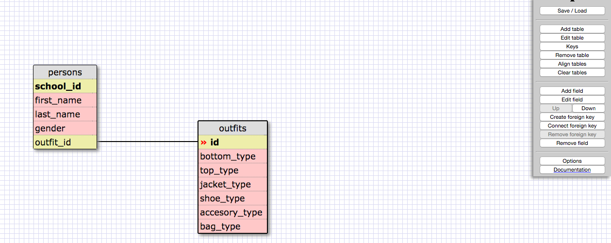

#SQL Commands
```sql
1. SELECT * FROM states;
2. SELECT * FROM regions;
3. SELECT state_name,population FROM states;
4. SELECT state_name,population FROM states ORDER BY population DESC;
5. SELECT state_name FROM states WHERE region_id=7;
6. SELECT state_name,population_density FROM states WHERE population_density>50 ORDER BY population_density;
7. SELECT state_name FROM states WHERE population BETWEEN 1000000 AND 1500000;
8. SELECT state_name,region_id FROM states ORDER BY region_id ASC;
9.SELECT region_name FROM regions WHERE region_name LIKE "%Central%";
10. SELECT regions.region_name,states.state_name FROM states INNER JOIN regions ON states.region_id=regions.id ORDER BY regions.id ASC;
```




#Reflection

##What are databases for?
  Databases are used to store data in a structured way that can be later accessed.
##What is a one-to-many relationship?
  A one-to-many relationship means one entity is linked to another entity. The first entity or table can have many records linked to the second table, but each record in the second table can only belong to one and only one record in the first table.
##What is a primary key? What is a foreign key? How can you determine which is which?
  A primary key is a distinct and unique value that cannot be the same for more than one record. Each table can only have one primary key. A foreign key is a column or combination of columns that links two entities or tables together.
##How can you select information out of a SQL database? What are some general guidelines for that?
  You can select information from an SQL database by using the keyword SELECT.You can choose, which column or columns you would like from a certain table or tables and order tables by certain specifications.